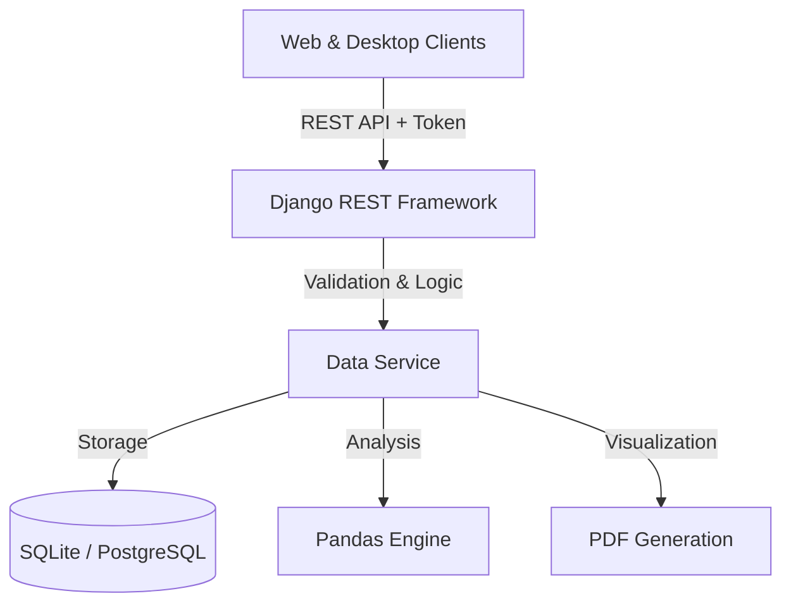

# Chemical Equipment Parameter Visualizer

**A full-stack analytical platform for visualizing and comparing chemical equipment data.**

> 🚀 **Live Demo:** [chemical-equipment-parameter-visual-nu.vercel.app](https://chemical-equipment-parameter-visual-nu.vercel.app)
> _(Note: Live demo uses ephemeral storage; data resets on restart.)_

---

## 🏛️ Architecture Overview

This project implements a **stateless, token-based REST API** architecture designed for scalability and clear separation of concerns.



### Core Flow
1.  **Ingestion:** User uploads CSV → Backend validates schema & content type.
2.  **Processing:** Pandas processes raw data to compute statistical averages and distributions.
3.  **Storage:** Metadata and summary stats stored in DB; Raw JSON/CSV cached for retrieval.
4.  **Consumption:** Frontend requests JSON for interactive charts or Binary PDF for reporting.

---

## 🛠️ Design Decisions

We prioritized **reliability, consistency, and user experience** in our engineering choices:

*   **Server-Side Validation:** All CSV parsing and validation happens on the backend (Pandas) rather than the client. This ensures data consistency regardless of whether the upload comes from the Web App, Desktop App, or direct API calls.
*   **Stateless Authentication:** Token-based Auth (DRF) allows the backend to serve both React (Web) and PyQt5 (Desktop) clients uniformly without session management complexity.
*   **Storage Optimization:** A "Last-5" dataset retention policy is enforced per user. This prevents storage bloat while keeping recent history available for comparison, optimizing for the constraints of a demo environment.
*   **SQLite Database:** Chosen for development simplicity and ease of local replication. The Django ORM allows seamless switching to PostgreSQL for production (as configured in `settings.py`).

---

## ⚠️ Known Limitations

In the interest of transparency, the current V1.0 release has the following constraints:
*   **File Size:** Optimized for CSV files under 10MB to ensure sub-second response times on standard concurrent requests.
*   **Concurrency:** Large simultaneous uploads are queue-bound by the Gunicorn worker count (default: 4).
*   **Authentication:** Utilizes local database authentication. 
---

## 🚀 Quick Start

### Prerequisites
*   Python 3.8+
*   Node.js 18+

### 1. Backend Setup
```bash
cd backend
python -m venv venv
# Windows: venv\Scripts\activate | Mac/Linux: source venv/bin/activate
pip install -r requirements.txt
python manage.py migrate
python manage.py runserver
```

### 2. Frontend Setup
```bash
cd web
npm install
npm run dev
```

### 3. Desktop App
```bash
cd desktop
pip install -r requirements.txt
python main.py
```
*(Or download the standalone executable from Releases)*

---

## 📚 Documentation

Detailed documentation for reviewers and developers:

*   **[📂 API Documentation](backend/API_DOCUMENTATION.md)** - Endpoints, Request/Response examples.
*   **[☁️ Deployment Guide](/DEPLOYMENT_GUIDE.md)** - Production setup for Render/Vercel.

---

## 🧪 Testing

We employ a comprehensive test suite covering Models, Views, and Validation logic.

```bash
cd backend
python manage.py test api.tests
```

**Key Test Areas:**
*   `test_validators.py`: Ensures only valid CSVs with correct columns are processed.
*   `test_views.py`: Verifies API response structures and status codes.

---

## 🔧 Tech Stack

| Component | Technology | Reason |
|-----------|------------|--------|
| **Backend** | Django REST Framework | Robust serialization & security features. |
| **Analysis** | Pandas | High-performance data manipulation. |
| **Web** | React + Vite | Fast HMR and efficient component-based UI. |
| **Desktop** | PyQt5 | Native look-and-feel cross-platform app. |
| **Reporting** | ReportLab | Programmatic PDF generation with vector charts. |

---

*Note: The `web/public/*.zip` file in the repo is an artifact of the build process.*
