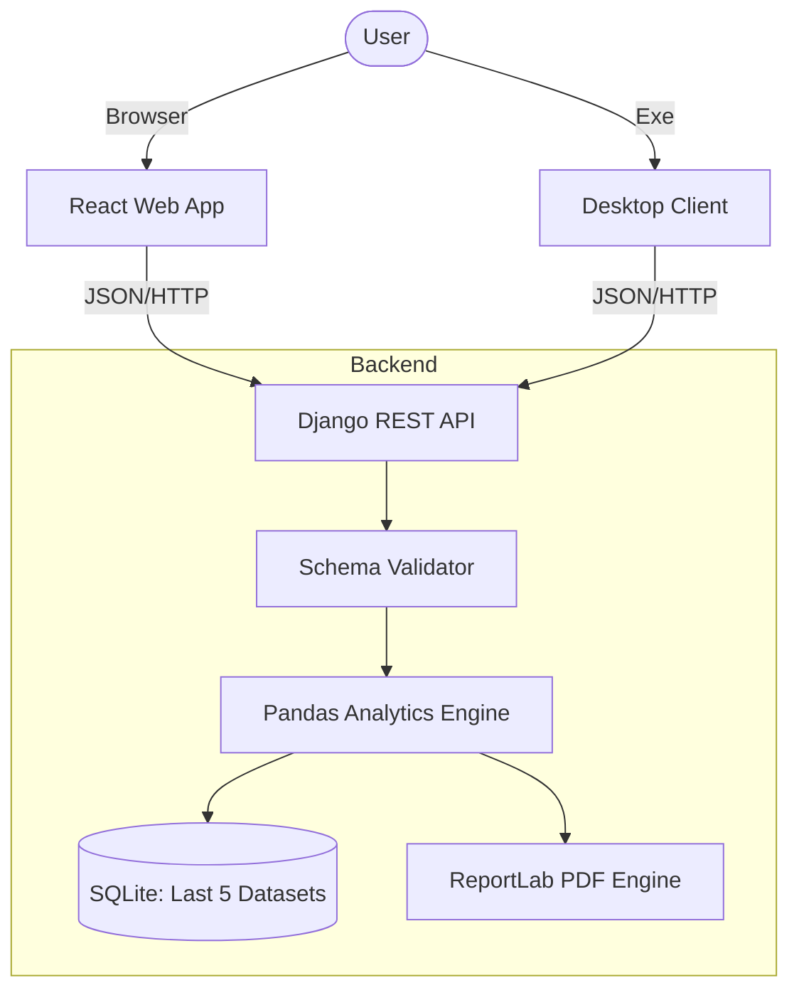

<div align="center">

<h1>Chemical Equipment Parameter Visualizer</h1>

<p>
    <strong>Precision Engineering Meets Modern Web Development</strong>
</p>

<p>
    A high-performance industrial analytics platform designed to ingest, visualize, and report on critical chemical process data.
    <br />
    <em>Built with Django, React, and PyQt5.</em>
</p>

<p>
    <a href="https://chemical-equipment-parameter-visual-nu.vercel.app/" target="_blank"><strong>🚀 Launch Web Application</strong></a> • 
    <a href="https://chemical-equipment-parameter-visualizer-unts.onrender.com" target="_blank"><strong>Backend API Root</strong></a> • 
    <a href="https://github.com/mimo-to/Chemical-Equipment-Parameter-Visualizer/releases"><strong>Download Desktop Client</strong></a>
</p>

</div>

<br />

---

## 📸 Project Gallery

A comprehensive view of the system's capabilities.

<table width="100%">
  <tr>
    <td width="33%" align="center">
      
      <br />
      <strong>Secure Authentication</strong>
    </td>
    <td width="33%" align="center">
      
      <br />
      <strong>Robust Data Ingestion</strong>
    </td>
    <td width="33%" align="center">
      
      <br />
      <strong>Real-time Analytics</strong>
    </td>
  </tr>
  <tr>
    <td width="33%" align="center">
      
      <br />
      <strong>Dataset Comparison</strong>
    </td>
    <td width="33%" align="center">
      
      <br />
      <strong>Historical Archives</strong>
    </td>
    <td width="33%" align="center" style="vertical-align: middle;">
        <em>Vector-Graphic PDF Reports generated on-demand (see Doc links).</em>
    </td>
  </tr>
</table>

---

## 🏗️ Architecture & Process Flow

This project utilizes a **Single-Backend, Multi-Client** architecture to ensure data integrity across all interfaces. The flow is designed for zero-latency feedback and strict data validation.



### Data Pipeline
1.  **Ingestion**: CSV files are uploaded via a secure, rate-limited endpoint.
2.  **Validation**: Strict schema enforcement ensures only valid flowrate, pressure, and temperature data enters the system.
3.  **Analysis**: The Pandas engine computes statistical aggregates (mean, min, max) in-memory to avoid floating-point inaccuracies.
4.  **Storage**: Data is committed to SQLite with a constraint-based retention policy (last 5 uploads per user).
5.  **Reporting**: On-demand generation of professional PDF reports using ReportLab.

---

## ⚡ Performance & Limits

To ensure optimal performance on the demonstration tier, the following constraints are enforced.

| Metric | Limit | Rationale |
| :--- | :--- | :--- |
| **CSV Size** | **10 MB** | Prevents memory overload on free-tier instances. |
| **Analysis Time** | **< 1 Second** | Benchmark for datasets under 1,000 rows. |
| **History Retention** | **5 Datasets** | Ensures database lightweight operation; strict FIFO rotation. |
| **Upload Rate** | **10 Req/Min** | Prevents denial-of-service abuse. |

---

## 🧠 Key Design Decisions

*   **Django REST Framework**: Selected to provide a robust, standardized API layer that allows the React and PyQt5 clients to function identically.
*   **Pandas for Analytics**: Python's Pandas library is used for all numerical computation to ensure deterministic results, avoiding client-side JavaScript math discrepancies.
*   **Server-Side PDF Generation**: Reports are generated on the backend to guarantee consistent formatting and high-resolution output regardless of the client device.
*   **Hub-and-Spoke Model**: By centralizing logic in the API, we reduce code duplication and simplify maintenance.

---

## 📚 Documentation Hub

Everything needed to deploy, audit, and understand the system.

| Document | Description |
| :--- | :--- |
| **[Deployment Guide](DEPLOYMENT.md)** | Instructions for deploying the Backend (Render), Frontend (Vercel), and building the Desktop Client. |
| **[API Specification](backend/API_DOCUMENTATION.md)** | Detailed reference for all REST endpoints, including request/response examples. |
| **[Security Policy](SECURITY.md)** | Overview of the authentication model, data isolation, and production hardening recommendations. |
| **[Sample Report](Generated_pdf_sample.pdf)** | A downloadable example of the vector-graphic PDF reports generated by this system. |

---

## Local Installation

### Backend Setup
```bash
cd backend
python -m venv venv
# Windows: venv\Scripts\activate | Mac: source venv/bin/activate
pip install -r requirements.txt
python manage.py migrate
python manage.py runserver
```

### Frontend Setup
```bash
cd web
npm install
npm run dev
```

---

**© 2026 Chemical Equipment Parameter Visualizer**
