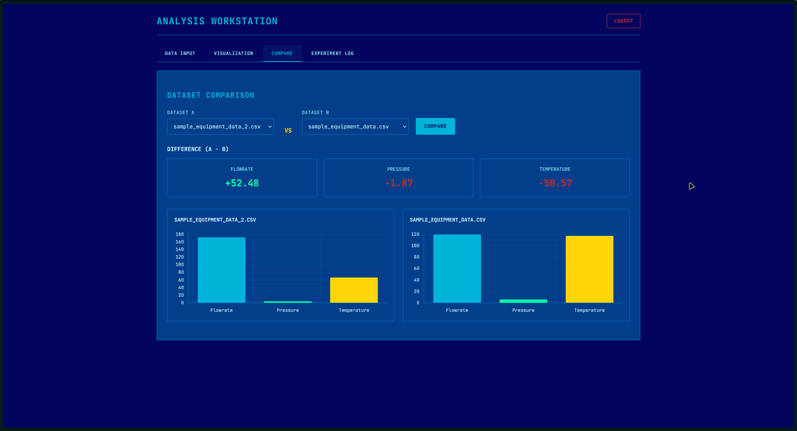
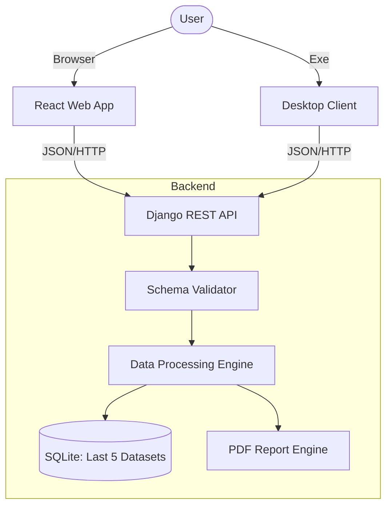

<div align="center">

<h1>Chemical Equipment Parameter Visualizer</h1>

<p>
    <strong>Precision Engineering Meets Modern Web Development</strong>
</p>

<p>
    A high-performance industrial analytics platform designed to ingest, visualize, and report on critical chemical process data.
    <br />
    <em>Built with Django, React, and PyQt5.</em>
</p>

<p align="center">
    <a href="https://chemical-equipment-parameter-visual-nu.vercel.app/"></a>
    <a href="LICENSE"></a>
    
    
</p>

<p>
    <a href="https://chemical-equipment-parameter-visual-nu.vercel.app/" target="_blank"><strong>Launch Web Application</strong></a> • 
    <a href="https://github.com/mimo-to/Chemical-Equipment-Parameter-Visualizer/releases/tag/Final-Release"><strong>Download Desktop Client</strong></a>
</p>

</div>
<br />

---

## Project Objective

This project was developed as part of the **FOSSEE Semester Internship – Web Application Screening Task**.

The objective was to design a **single-backend, multi-client analytics system** that demonstrates:

-   **Clean API Design**: RESTful architecture serving multiple platforms.
-   **Deterministic Data Processing**: Server-side calculation for precision.
-   **Consistent Visualization**: Unified data structures for Web and Desktop.
-   **Production-Aware Constraints**: Handling real-world limitations (rate limiting, file validation).

All features strictly follow the official problem statement, without scope inflation.

---

## Project Gallery

A comprehensive view of the system's capabilities.

<table width="100%">
  <tr>
    <td width="33%" align="center">
      
      <br />
      <strong>Secure Authentication</strong>
    </td>
    <td width="33%" align="center">
      
      <br />
      <strong>Robust Data Ingestion</strong>
    </td>
    <td width="33%" align="center">
      
      <br />
      <strong>Real-time Analytics</strong>
    </td>
  </tr>
  <tr>
    <td width="33%" align="center">
      
      <br />
      <strong>Dataset Comparison</strong>
    </td>
    <td width="33%" align="center">
      
      <br />
      <strong>Upload History</strong>
    </td>
    <td width="33%" align="center" style="vertical-align: middle;">
        <h3><a href="Project_outcomes/Generated_pdf_sample.pdf">Download Sample Report</a></h3>
        <p><em>Vector-Graphic PDF with Charts</em></p>
    </td>
  </tr>
</table>

---

## API Overview

The backend provides a comprehensive REST API. For full details, Request/Response examples, and error codes, refer to the **[API Specification](backend/API_DOCUMENTATION.md)**.

| Method | Endpoint | Description |
| :--- | :--- | :--- |
| `POST` | `/api/login/` | Authenticates user and returns API Token. |
| `POST` | `/api/upload/` | Ingests CSV, validates schema, and returns analysis. |
| `GET` | `/api/history/` | Retrieves the last 5 uploaded datasets. |
| `GET` | `/api/dataset/<id>/` | Fetches specific dataset details. |
| `POST` | `/api/compare/` | Compares two datasets side-by-side. |
| `GET` | `/api/report/<id>/` | Generates and downloads a specific PDF Report. |
| `GET` | `/api/health/` | Server warming ping (mitigates cold starts). |

---

## Project Structure

This project follows a strict Hub-and-Spoke architecture, separating concerns into three distinct directories.

```text
.
├── backend/                  # Django REST API (The "Hub")
│   ├── api/                  # Business Logic Application
│   │   ├── views.py          # API Logic & Validation
│   │   ├── serializers.py    # Data Transformation
│   │   └── models.py         # Database Schema
│   ├── config/               # Project Settings
│   │   ├── settings.py       # Middleware & Security Config
│   │   └── urls.py           # Route Definitions
│   └── manage.py             # CLI Entry Point
│
├── web/                      # React Frontend (Web "Spoke")
│   ├── src/
│   │   ├── components/       # Reusable UI (Charts.jsx, Upload.jsx)
│   │   ├── services/         # API Integration Layer
│   │   └── App.jsx           # Routing Logic
│   └── vite.config.js        # Build Optimization
│
├── desktop/                  # PyQt5 Client (Desktop "Spoke")
│   ├── main.py               # Main Application Loop
│   └── requirements.txt      # Executable Dependencies
│
└── Project_outcomes/         # Documentation & Assets
```

---

## Architecture & Process Flow

This project utilizes a **Single-Backend, Multi-Client** architecture to ensure data integrity across all interfaces. The flow is designed for zero-latency feedback and strict data validation.



### Data Pipeline
1.  **Ingest**: User uploads CSV via Drag-and-Drop.
2.  **Validate**: Strict schema enforcement (Flowrate, Pressure, Temperature).
3.  **Process**: server-side Pandas engine computes statistics (Mean, Min, Max).
4.  **Store**: Data is saved to the user's isolated account.
5.  **Report**: PDF engine generates vector-graphic reports on demand.

---

## Local Setup Guide

Follow this guide to run the full stack (Backend, Web, and Desktop) on your local machine for evaluation.

### Prerequisites
*   Python 3.9+
*   Node.js 18+
*   Git

### 1. Clone & Prepare
```bash
git clone https://github.com/mimo-to/Chemical-Equipment-Parameter-Visualizer.git
cd Chemical-Equipment-Parameter-Visualizer
```

### 2. Backend Setup (The Core)
```bash
cd backend
# Create Virtual Environment
python -m venv venv

# Activate (Windows)
venv\Scripts\activate
# Activate (Mac/Linux)
source venv/bin/activate

# Install Dependencies
pip install -r requirements.txt

# Initialize Database
python manage.py migrate

# Create Superuser (Optional)
python manage.py createsuperuser

# Start Server
python manage.py runserver
```
*Server will start at `http://127.0.0.1:8000/`*

### 3. Frontend Setup (Web Client)
```bash
# Open a new terminal
cd web

# Install Dependencies
npm install

# Start Development Server
npm run dev
```
*Web App will start at `http://localhost:5173/`*

### 4. Desktop Client Setup (Run from Source)
For validators wishing to test the Desktop App without the `.exe`:
```bash
# Open a new terminal
cd desktop

# Install Dependencies (PyQt5)
pip install -r requirements.txt

# Run Application
python main.py
```

---

## Documentation Index

| Document | Description |
| :--- | :--- |
| **[Deployment Guide](DEPLOYMENT.md)** | Instructions for Render, Vercel, and Desktop build. |
| **[API Specification](backend/API_DOCUMENTATION.md)** | Detailed REST endpoint reference. |
| **[Security Policy](SECURITY.md)** | details on Auth, Isolation, and Hardening. |
| **[Testing Guide](TESTING.md)** | Comprehensive validation protocols. |

---

## Performance & Limits

To ensure optimal performance on the demonstration tier, the following constraints are enforced.

| Metric | Limit | Rationale |
| :--- | :--- | :--- |
| **CSV Size** | **10 MB** | Optimization for free-tier instance memory constraints. |
| **Analysis Time** | **< 1 Second** | Benchmark for datasets under 1,000 rows. |
| **History Retention** | **5 Datasets** | Strict FIFO rotation policy for efficient storage. |

---

## Known Limitations

Full transparency on what this system is *not* designed to do:

*   **No Concurrent Multi-User Editing**: The system is designed for atomic, isolated user sessions.
*   **Token-Based Auth**: Uses permanent tokens for simplicity. Production would require JWTs with refresh rotation.
*   **SQLite Concurrency**: While sufficient for this demo, SQLite is not intended for high-scale concurrent writes in production.
*   **Desktop Client**: Currently packaged and tested for Windows environments.

> These are intentional trade-offs aligned with the screening scope.

---

## Deployment Constraints (Render Free Tier)

This application is deployed on **Render's Free Tier** for demonstration purposes.

> **1. Cold Starts (Server Sleep)**
> *   **Constraint**: The server spins down after 15 minutes of inactivity.
> *   **Impact**: The **first request** may take **50-60 seconds**.
> *   **Mitigation**: The frontend includes a "Warming Ping" triggered on the Login page.

> **2. Ephemeral Filesystem (Data Loss)**
> *   **Constraint**: Render's free instances do not have persistent storage.
> *   **Impact**: **All Data is wiped** whenever the application is re-deployed.

> **3. Upload Limits**
> *   **Constraint**: 10MB User Upload Limit enforced by Nginx.

---

**© 2026 Chemical Equipment Parameter Visualizer**
